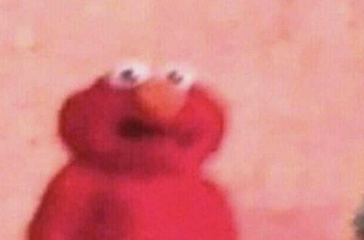
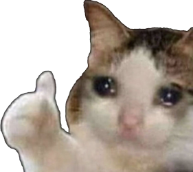

 
This is one of those times that you never think would happen and so quickly at that. Since the start of quarantine, I’ve been contemplating about how life has changed daily. I’m no stranger to staying home all day for weeks, but it’s so different this time. Being forced to stay in and choosing to stay in are two different things in my eyes. 
 

 

## School
This is my first semester here transferring from LCC, so it’s very saddening to see that it’s cut short. I was anxious that I wouldn’t find friends and struggle with the daily routine, but that wasn’t the case. I made friends with a group that struggle along with me in ICS 311, and my routine of spending at least 13 hours on campus every day didn’t seem so bad. In fact, now I really miss everyone and having that structure in my life. I’ve always been a major introvert with a weak social battery, but what I did experience from this semester changed that. I need the face-to-face interaction with friends, and the sudden change has taken a toll on my mental health.

Online classes are one of my biggest fears. The anxiety is so bad that I often get nightmares about forgetting to submit assignments or complete exams. Classes like physics and ICS 311 are difficult enough already, so being forced to transition online now proves to be a losing battle for me. I’m just one of those people who need to be taught in class because learning at home is way too distracting. I find myself lying in bed all day due to my lack of motivation and when I do try to work, my attention is lost after the first 10 minutes. While this isn’t the best situation for me, I’m just grateful that there still is class and that most professors are being understanding. It really comes down to having the grit to get through this.
  

## Work
My dad is the only one who works in the family now since he does construction. I work as a server for a Korean BBQ restaurant which is clearly not essential, so I’m currently out of a job. Having no personal income as of now isn’t ideal since I’ve been saving up to buy books, help my parents pay tuition, and hopefully go on a trip in the near future. Frankly, I miss making money and practicing my social skills with customers. I know that unemployment is even harder for other people. One of my friends is in the mainland for college and her parents are both out of a job; they make enough just to get by. She told me that even if she were able to come back home because COVID-19 has calmed down, they wouldn’t be able to afford the flight back home for a while.
  

## Moving Forward
Really the best and only choice we have is to practice social distancing to flatten the curve. A vaccine may not be available for another year, and there’s the chance that COVID-19 could mutate to be resistant. I think that this pandemic unearthed a lot of flaws in the American healthcare system and particularly Hawaii’s government due to how they decided to handle the situation. I’m clueless to how we can fix these issues, but I have hope that they will change because of the virus.

Although this is a painful time both physically for some and mentally for others, this should be a lesson for everyone. Appreciate all the workers who are still out doing their thing because they’re risking their health. I personally realized that I need to stop wasting so much time on useless things. I’m sitting here at home regretting all the things that I didn’t do. When this is over, first thing I’m going to do is go to the beach and watch a sunset with friends or something. Life is too short to waste any moment.

