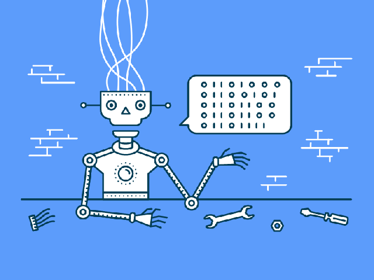

## Add That to the List
Finding a major in college is difficult when you are indecisive and have too many interests. From medicine to design to film, I could never decide what direction I wanted to go. In the back of my mind, I always thought, “Maybe I’ll be decent at coding.” I decided to pursue this thought by taking ICS 111, the introduction to Java class. I ended up enjoying the process of writing code from scratch to solve a problem. It was both frustrating and satisfying; the combination of these emotions was addicting to say the least. Thus, programming was scribbled onto my list of passions.

## The Best of Both Worlds
I never consciously thought about the relationship between technology and art. Through software engineering, I realized that I could connect the two. Because of my background in art, I appreciate the front-end development more and possibly would like to pursue that side of software engineering. 

## The Future
The number one skill that I hope to develop is communication. Since most work will be in teams, it is essential to be able to communicate ideas clearly and manage healthy relationships with coworkers. Another skill I want to master is creativity. This would allow me to be a better problem-solver, which is important in this field. 
At this point in my life, I’m not exactly sure where I will go in the field of computer science. I do know that I want to use my developed skills for not only employment but also volunteering. I would love to experience working in a large company like Google or YouTube, and I would also like to volunteer my time for creating/maintaining websites for nonprofit organizations.

