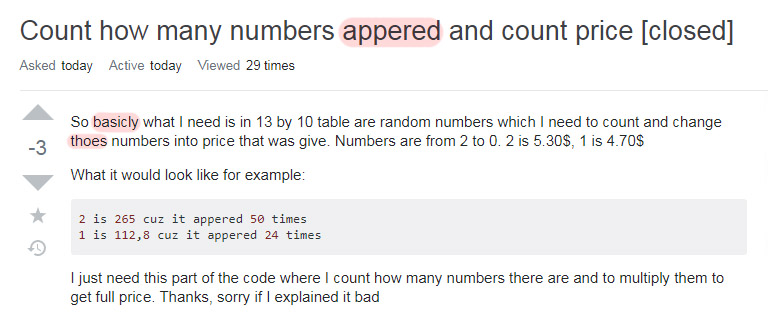

## Think Before You Post
*“There’s no such thing as stupid questions.”*

Maybe not stupid, but there are definitely lazy questions. It’s quite clear when someone poses a question without trying to think about an answer first. This brings us to the discussion of the opposite- what is a “smart question”? For the case of software engineering, it’s one that comes prepared by either inserting code or adding pictures to further illustrate the problem at hand. A “smart question” also clearly states the problem and formats it to make it easy to read. It’s important to ask smart questions because those will be worth the time it takes to develop and answer them. Next, let’s look at one example each of a smart question and not-so-smart one from Stack Overflow. 

## Can’t Mistake Laziness
So, what’s not smart about [this](https://stackoverflow.com/questions/59992090/count-how-many-numbers-appered-and-count-price
) question?

Just glancing at the post, there are a few spelling and grammar errors. Immediately in the title and first line of the post, there are words spelled incorrectly like “appered” and “basicly”. This is off-putting for anyone who sees the post because it looks like the user didn’t bother to double check and isn’t detail-oriented. In addition, the user didn’t upload any attempted code. A user comments below asking, “And what have you tried so far?” because in order to help, it’s important to know what the inquirer has tried first to use that as a starting point for the answer. The asker ends the post with, “I just need this part of the code where I count how many numbers there are and to multiply them to get full price.” I have no clue about the person’s true motive, but it seems like he or she just wants someone else to do the code. Seems like a few other users on Stack Overflow agree that this isn’t a smart question as there are already there are 3 downvotes. 

  

## The Good in a Sea of Bad
And what makes [this](https://stackoverflow.com/questions/15285643/how-to-get-a-50-50-chance-in-random-generator
) question better than the previous?

One thing this user does is make the post easy on the eyes. He or she uses indentation and inserts code blocks between sentences where they make logical sense. Of course, the code blocks show what’s being used to generate the random number and the attempt at using a for loop.  Another thing the user does well is keeping the post concise. Granted this is a simpler example, but he or she doesn’t load the post with other unnecessary details and further clarifies the problem in the last line with, “So I want this loop to generate 50 times of number 1 and 50 times of number 2.” Answering a question like this makes the process easier on both the inquirer and the responder. Compared to the last post, this one has 26 upvotes, meaning that people do think this question is good and helpful.

## What is the Lesson Here?
Between the two polar opposite posts discussed above, it is clear how simple things like spelling and format make the world of a difference. It also shows how putting in thought before posting a question makes the world of a difference. As a software engineer, coming up with smart questions is essential to problem solving. Many times, projects are worked on in teams, and this is where communicating the question at hand clearly will make for efficient use of time and brains.
