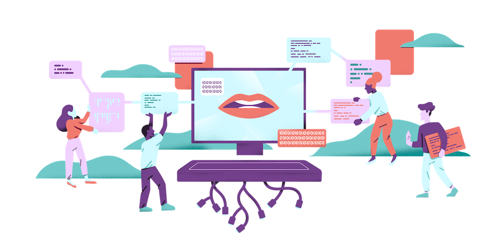
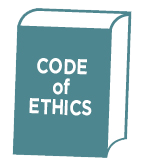

*"There's no question that as science, knowledge and technology advance, that we will attempt to do more significant things. And there's no question that we will always have to temper those things with ethics."*

~ Ben Carson

 
## Ethics in Software Engineering
Ethics is a difficult term to define in a sentence or two. Although there is a general feeling as to what ethics is, it takes on many formal definitions depending on the field it’s being applied to. In the context of software engineering, it generally means creating code that serves public welfare and upholds the highest quality for both the client and the people. 
The [ACM Code of Ethics](https://www.acm.org/code-of-ethics) is one of many sets of coding ethics, and I will be referencing that throughout this essay.

I’ve never given much thought about how ethics works in computer science since I’ve been too focused on just learning the fundamentals about how to code, etc. I’ve been aware that ethical issues were always present in technology especially due to the growth of the Internet and social media like Facebook. These are more privacy issues, and there are those where one’s code can impact public health. In the following section, I will discuss a case study where a developer coded a website he's ashamed of to this day.

 

## Regrets
Bill Sourour was 21 years old at the time when he was asked to make a website targeted at teenage girls for a pharmaceutical company. The website featured a quiz that would recommend someone a drug after a series of questions, but no matter what the answers were, only the client’s drug would be recommended. This promoted drug unfortunately caused severe depression and suicidal thoughts, which resulted in the loss of lives. Looking at this case objectively, it didn’t follow ACM’s Code of Ethics, specifically Section 1.2: "Avoid harm". However, it did uphold Section 2.1: "Strive to achieve high quality in both the processes and products of professional work" as the client was super pleased with the site.

 

## Things Happen For a Reason
If I were in Bill’s shoes, I would probably feel and react the same way because it’s not easy to digest that what you created somehow had a part in the loss of lives. As for my stance on this case, I believe that Bill was not at fault. Yes, he could have questioned the company’s motive and declined the job, but the website would have been created either way by another willing person. This was a large pharmaceutical company he was dealing with, and his say being the youngest on the development team would not have mattered much. Ultimately, I believe that the fault lies in the company and their ethics in how they promoted the drug. I’m not aware of the statistics of deaths caused by the drug, but this situation could have been a lot worse. Indeed, this was a tragic case, but what's important is that it taught Bill many lessons involving his line of work and ethics. It also makes us aware of how we as emerging developers should thoroughly examine what we are writing code for and **ask questions** to get a handle of our work’s implications. 
