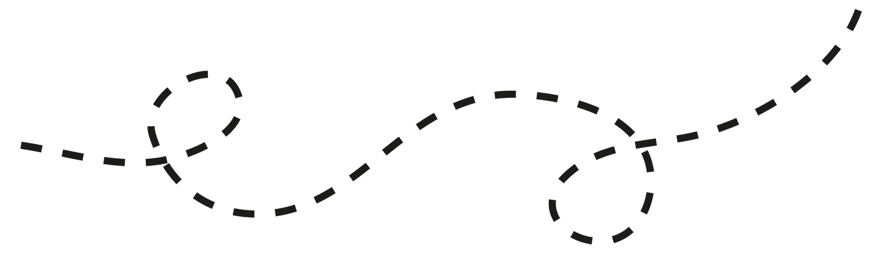

 
Instead of writing a whole essay on how I felt about frameworks, how about I just leave this picture here.   

 
 

Kidding.
 
 

Anyways, I've always heard that HTML and CSS are easy languages to understand and pretty basic knowledge for anyone in the computer science field. I can somewhat agree, but having no previous experience with either, I admit to struggling with the syntax and structure at first. Add a framework like Semantic UI to that mix and somehow I'm even more lost. I appreciate how using a framework instantly makes the creation look more modern and appealing, but the complexity of it is levels above basic HTML and CSS.
 
 

# A Treacherous Trek Through Frameworks
  
Learning Semantic UI is like going on a new, long hike. The beginning is filled with excitement and a dash of anxiety as you’re trying something new. You pretty much go in blindly with only hope to serve as a guide. Halfway through the journey, you get lost and a little stuck. With an uneasy feeling about getting through the rest, you think, "Why did I even try this?" That's exactly what I felt like when I started using Semantic. What started off as a simple hike quickly turned into climbing Everest for me. Okay, maybe I’m being too dramatic, but it was difficult. I think the difficulty lies in the fact that Semantic uses a description-based system that resembles casual English. For example, if I wanted to make an image small, I'd just have to use the phrase "ui small image". It's as simple as that.

<i>If it's that simple, then what was I so confused about?</i> 
Well, it comes from the fact that there are endless combinations of descriptions that may or may not work. Luckily, Semantic provides a website which contains all the possible combinations that can be constructed and provides examples for how they can be assembled. Wonderful! Except for the problem that there are literally over 20 or so elements that can be modified and changed with even more elements. Memorizing all the different combinations prove to be quite the challenge. That's like the hike having multiple paths that lead to the same place or maybe a different spot with even more paths, and the whole thing gets confusing. I've had to spend hours just experimenting with containers and grids because I didn’t understand the difference and alt-tab-ing my way between the website and my code too many times.
 
 

# Whoo, the End!
This was my first time using a framework, so feeling temporarily discouraged was a given. Even through all the difficulty, it was an enlightening experience that trained me to problem solve and keep practicing. Through all the practice WODs and hours of researching, I can confidently say that I refer to the Semantic website less now. Although I’m still not perfect at Semantic, it inspires me to keep going until I’m close to perfect and experience what other frameworks have to offer.
 
 

