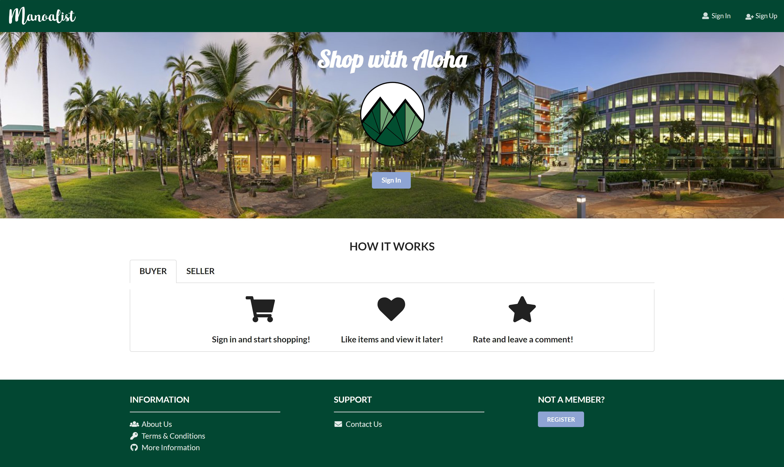

 

## WHAT IS MANOALIST?
A website specifically designed for University of Hawaii at Manoa students to buy and sell student-related goods. Users can post valid information about their products on the platform, and the products will be displayed by searching their key words (label). It will be similar to the existing website “Craigslist” with added functionality. Our goal is to work closely as a team and develop a website that is both functional and aesthetic.

Features:
* Ensure only UH students are allowed access
* Log in to view/post items for sale
* Rate sellers after purchase
* “Like” items to view later
  

## THE DEVELOPERS
Manoalist was developed by a team of five UH Manoa students: [Craig Opie](https://craigopie.github.io/), [Weirong He](https://heweiron.github.io/), [Tianhui Zhou](https://tianhuizhou.github.io/), [Edwin Zheng](https://edwin-zheng.github.io/), and me.

My contribution to the project was mainly front-end tasks. 
Here are the things I contributed:
* Desgined the logo
* Redesign the sign up page
* Form the basis for the create a listing page
* Create the item page format
* Touched up page visuals
  

## THE EXPERIENCE
Overall, it was a great experience working with my team. My team was diverse in terms of our experiences, which played in our favor. We had routine meetings twice a week through Zoom to discuss everyone's progress and future issues we need to work on. This was my first time developing a website, so things were confusing for me, of course. I developed a greater understanding for Mongo, Meteor, Semantic UI React, and web design in general. I have to say working with forms were tricky for me 

Project Page: [Manoalist](https://manoalist.github.io/) 
GitHub Repo: <a href="https://github.com/manoalist/manoalist"><i class="medium github icon"></i>"manoalist/manoalist"</a>
